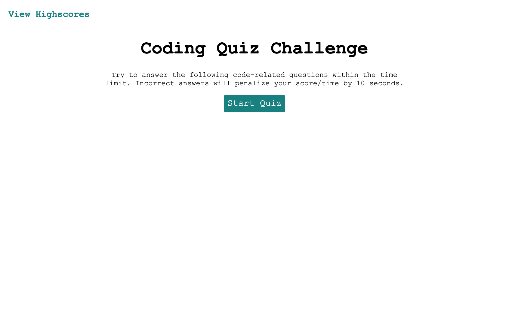

# Coding Quiz
This Coding Quiz is intended to be a timed quiz on JavaScript fundamentals that stores high scores so that a user can gauge his/her progress. Unfortunately, this quiz is still a work in progress at this time. I have submitted my progress thus far. This app will run in the browser, and will feature dynamically updated HTML and CSS powered by JavaScript code.

## Deployment
Coding Quiz is published at https://kristinmoon.github.io/coding-quiz/.

## Author
Written by <a href="https://kristinmoon.github.io/portfolio">Kristin Moon</a>
